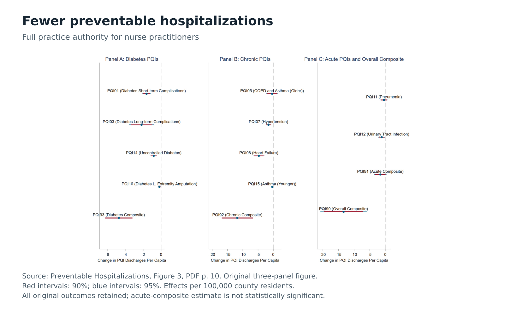

::: {.home-shell}
::: {.hero-grid}
::: {.hero-copy}
<p class="hero-roles">Jere L. Beasley Professor of Law<br>Director of Interdisciplinary Legal Studies<br>University of Alabama School of Law</p>

<h1 id="hero-title" class="hero-title">Benjamin J.<br>McMichael</h1>

<p class="hero-dek">Empirical research on health care regulation, professional licensing, medical markets, and health policy.</p>

::: {.hero-actions}
[View CV](cv.qmd){.site-button .site-button-primary}

[Research](research/index.qmd){.site-button .site-button-secondary}
:::
:::

::: {.research-window data-research-carousel="true" data-carousel-config="assets/research-observatory/carousel.json"}
::: {.research-window-header}
<p class="window-kicker">Research observatory</p>
<p class="window-index" data-carousel-status aria-live="polite" aria-atomic="true">01 / 07</p>
:::

```{=html}
<div class="research-carousel" data-carousel-viewport role="region" aria-roledescription="carousel" aria-label="Research figures and tables" tabindex="0">
  <figure class="research-carousel-slide" data-carousel-slide role="group" aria-roledescription="slide" aria-label="1 of 7">
    <a class="carousel-image-button" href="assets/research-observatory/01_hospitalizations.svg">
      
      <span class="visually-hidden">Open full-size figure</span>
    </a>
  </figure>
</div>

<div class="research-carousel-controls" data-carousel-controls hidden aria-label="Research carousel controls">
  <button type="button" data-carousel-previous aria-label="Show previous research figure"><span aria-hidden="true">←</span> Previous</button>
  <button type="button" data-carousel-pause aria-pressed="false"><span data-carousel-pause-label>Pause</span></button>
  <button type="button" data-carousel-next aria-label="Show next research figure">Next <span aria-hidden="true">→</span></button>
</div>

<dialog class="research-carousel-dialog" data-carousel-dialog aria-labelledby="research-carousel-dialog-title">
  <div class="research-carousel-dialog-shell">
    <div class="research-carousel-dialog-header">
      <h2 id="research-carousel-dialog-title" data-carousel-dialog-title></h2>
      <button type="button" class="carousel-dialog-close" data-carousel-dialog-close>Close</button>
    </div>
    <div class="research-carousel-dialog-figure">
      
    </div>
    <div class="research-carousel-dialog-meta">
      <p data-carousel-dialog-source></p>
      <p data-carousel-dialog-treatment></p>
    </div>
    <div class="research-carousel-dialog-table" data-carousel-dialog-table hidden></div>
  </div>
</dialog>
```
:::
:::

::: {.selected-research}
::: {.section-heading}
## Selected Research

[View all research](research/index.qmd){.text-link}
:::

::: {.publication-render}
:::
:::
:::

<script src="assets/js/research-carousel.js"></script>
